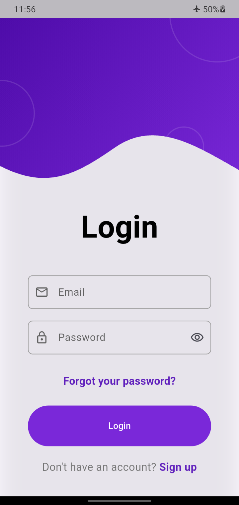
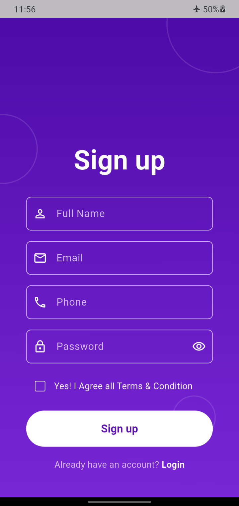

# Firebase Auth Starter

A Flutter project built to practice and demonstrate a complete authentication flow using Firebase.

I built this project as a small structured starter application. It includes registration, login, email verification, password reset, authentication state handling, reusable widgets, validation, and automated tests.

The goal was to keep the project simple while still following a clean structure that I can extended with more features later.

---

## Features

* Email and password registration
* User login
* User logout
* Email verification flow
* Password reset
* Authentication state handling with `AuthWrapper`
* Form validation
* Password visibility toggle
* Loading states during authentication
* Firebase error handling
* Responsive authentication UI
* Reusable authentication widgets
* Unit and widget tests

---

## Screenshots

### Login



### Sign Up



### Forgot Password


### Email Verification


---

## Tech Stack

* Flutter
* Dart
* Firebase Authentication
* Flutter Test

---

## Authentication Flow

The app uses an `AuthWrapper` to decide which screen should be shown based on the current authentication state.

```text
App Starts
    ↓
AuthWrapper
    ↓
Is the user logged in?
    ├── No → Login Screen
    │
    └── Yes
         ↓
    Is the email verified?
         ├── No → Verify Email Screen
         │
         └── Yes → Authenticated Screen
```

This keeps authentication navigation separate from the individual login and signup screens.

---

## Project Structure

```text
lib/
├── screens/
│   └── auth/
│       ├── login/
│       │   └── login_screen.dart
│       ├── signup/
│       │   └── signup_screen.dart
│       ├── forgot_password_screen.dart
│       └── verify_email_screen.dart
│
├── services/
│   └── auth_service.dart
│
├── utils/
│   └── validators.dart
│
├── widgets/
│   ├── auth_button.dart
│   └── auth_text_field.dart
│
├── auth_wrapper.dart
└── main.dart
```

The project separates the UI, authentication logic, validation, and reusable widgets so the screens don't contain everything in one place.

For example:

```text
Screen
  ↓
Validation / UI
  ↓
AuthService
  ↓
Firebase Authentication
```

---

## Reusable Widgets

### AuthTextField

The authentication text field is reused across different screens and supports multiple visual styles.

It is used for fields such as:

* Email
* Password
* Full Name
* Phone

It also supports features like:

* Validation
* Password hiding
* Suffix icons
* Different keyboard types
* Light and purple UI styles

### AuthButton

The authentication button handles the common button behavior, including the loading state.

Creating these widgets helped reduce repeated UI code between screens.

---

## Testing

The project includes unit and widget tests for the main authentication-related UI and validation logic.

The test suite covers:

* Validators
* `AuthTextField`
* `AuthButton`
* Login screen
* Signup screen
* Forgot password screen

The current test suite contains **44 passing tests**.

Run all tests with:

```bash
flutter test
```

For a code quality check:

```bash
flutter analyze
```

---

## Getting Started

### 1. Clone the repository

```bash
git clone https://github.com/Jahid-Islam-coder/firebase-auth-starter.git
```

### 2. Open the project

```bash
cd firebase_auth_starter
```

### 3. Install dependencies

```bash
flutter pub get
```

### 4. Configure Firebase

This project requires Firebase to be configured for your own Firebase project.

Set up Firebase for your Flutter application and enable:

* Email/Password Authentication

Make sure the Firebase configuration files for your platform are added.

### 5. Run the app

```bash
flutter run
```

---

## What I Learned

building this project, I learned  more than just connecting Firebase to my app.

Some of the things I practiced were:

* Separating authentication logic from UI code
* Using reusable widgets 
* Handling Firebase authentication errors
* Managing loading states
* Building an email verification flow
* Using an authentication wrapper to manage app state
* Writing unit and widget tests
* Updating tests when a reusable widget changes

One thing I found useful was seeing how a small change to a shared widget, like adding style variants to `AuthTextField`, can affect multiple screens and tests. this taught me that testing reusable components is important.

---

## Future Improvements

A few things I may add in future updates:

* Store user profiles in Cloud Firestore
* Add GitHub Actions CI to automatically run `flutter analyze` and `flutter test`

---

## License

This project is licensed under the MIT License.

---

## Author

Built by Jahid Islam as part of my Flutter development portfolio.
